# Find a pair game

## 📢 About

Nice to meet you Creators! 👋 Welcome to Runner template guide!

With Runner you can create amazing worlds to play with your friends!

Now, are you ready to start?

  

## ❓ How to create with Runner template

:wrench: Installation and settings

- Download Unity Hub and Unity 2020.3.9f1 version. ([Download](https://unity.com/releases/editor/archive))

- Pull the repository.

  

> 💡 Enjoy and start creating with the Template! :tada:

  

## 🔨 Tools

**GameManager**
The GameManager shows the basic settings for the game

| Variable      | Utility                                                       |
| ------------- | ------------------------------------------------------------- |
| Time Per Game | The base time amount for every game                           |
| Time To Hide  | The base time amount to hide for every game                   |
| Time To Catch | The time amount that the hunter will took to catch a prop     |
| Player Layer  | The hunter will catch the players that has the selected layer |

 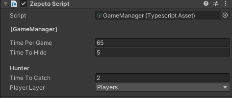</img> 

**UIManager**
The ui manager has a lot of references, all of them have to be like in the image to work well, but if you click one of them it will show you wich is the object that they reference.

 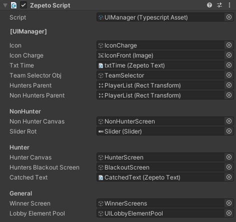</img> 

**Random Spawner**
The random spawner generates spawn areas where you want to.

| Variable     | Utility                                                 |
| ------------ | ------------------------------------------------------- |
| Spawn Size X | Set the size of the spawn area in the X axis            |
| Spawn Size Z | Set the size of the spawn area in the Z axis            |
| Spawnpoints  | Reference list to the spawnpoints that you have created |

 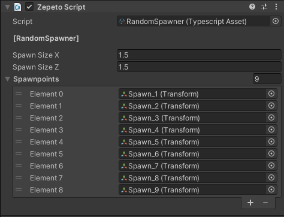</img> 

#####spawn point creation
To create an spawnpoint you have to create an empty object and position it where you want to create an spawn area.

 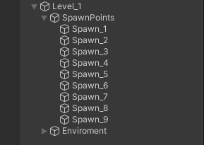</img> 

The spawn areas will be created on the start method of unity so, whe you click the play button this areas in the editor will show you the size of the areas visually

 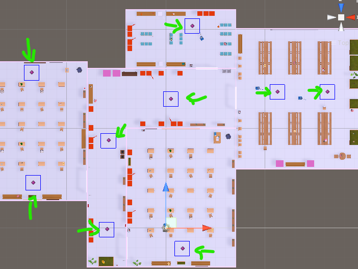</img> 

**Mutliplayer Manager**
This class is included into the multiplay component of the <a href="https://github.com/JasperGame/zepeto-modules"> Module importer</a> you can learn more about multiplayer <a href="https://docs.zepeto.me/studio/reference/multiplay">here</a>.

 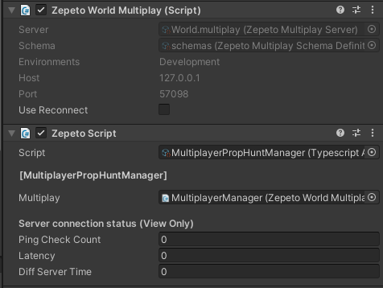</img> 
 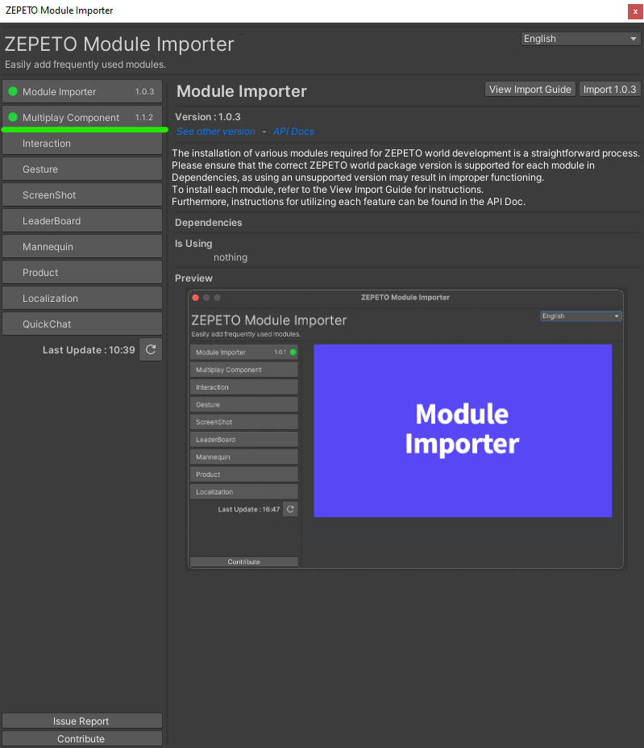</img> 

**Transformable item Manager**

This class controls the spawn of the buttons and the items which the player can transform in.
You can create a new item and drag and drop it on the list of items and it will create a new button automatically.

| Variable                      | Utility                                                               |
| ----------------------------- | --------------------------------------------------------------------- |
| uiTransformableButtonTemplate | Reference to the prefab button that will be created on the UI         |
| transformableButtonsParent    | Reference to the transform that will be the parent of the new buttons |
| itemsTransformablesSO         | List of the items that will be created, they are scriptable objects   |

 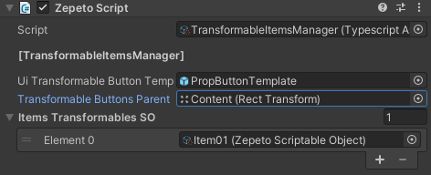</img> 

#####Item creation
To create a new item for the props we need to create a new item scriptable object (you can duplicate one of the existent)

 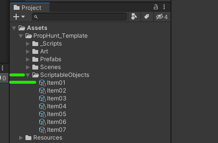</img> 

Every scriptable object will need some references to create a new object.

 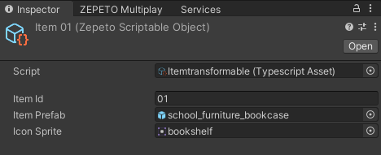</img> 

| Variable    | Utility                                                                           |
| ----------- | --------------------------------------------------------------------------------- |
| Item Id     | You have to set an UNIQUE ID for the item, any other scriptable can have the same |
| Item Prefab | The object to transform in (IMPORTANT NOTE: read after this board)                |
| Icon Sprite | The sprite that will be shown in the button on the UI                             |

######ITEM PREFAB WARNING:
 It **HAS** to have a **boxcollider**, it **cannot** be other type. It also has to have a mesh filter.

**Lobby Element Pool**
This is a pool of items to create in the ui of the lobby, the first variable **Ui Prefab** saves the prefab that will be created for the pool, and the **Parent Transform** saves the transform that will be the parent for those items.
To learn about the pool pattern you <a href="https://en.wikipedia.org/wiki/Object_pool_pattern">check it here.</a>

 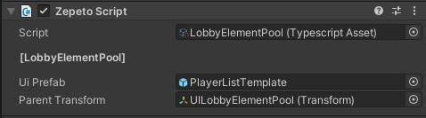</img> 

